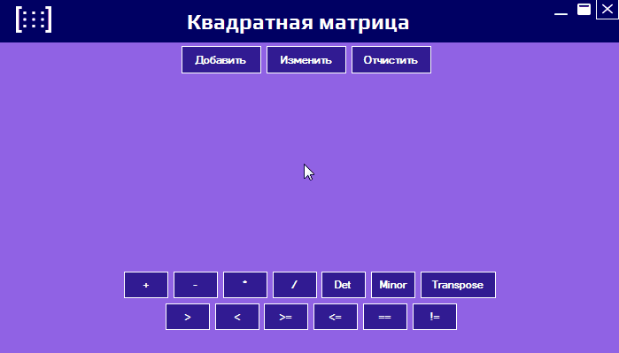

<h1 align="center">𝕄𝕒𝕥𝕣𝕚𝕩</h1>

<h1 align="center">

 

 

</h1>

<h1 align="center">

</h1>

>

<h1 align="center">Пакеты</h1>

# SVG.NET 

<h1 align="center">Репозитория</h1>

>
>

>Пример задания 
>
>    

Задание 3 - Перегрузка операций 
 
>   
>     Создать класс «Квадратная матрица». 
>     Реализовать конструкторы для случайной генерации матриц.
>     Выполнить перегрузку операций (+, *, >, < > = , < = , = = , ! = , приведения типов, true, false, нахождение детерминанта, обратная матрица).
>     Реализовать методы ToString(), CompareTo(), Equals(), GetHashCode().
>     Реализовать для класса паттерн «Прототип» с глубоким копированием.
>     Создать пользовательские классы Исключений и реализовать их обработку.
>     Реализовать тестовое приложение «Матричный калькулятор»  для демонстрации работы созданного класса.
>

>

> 
>

